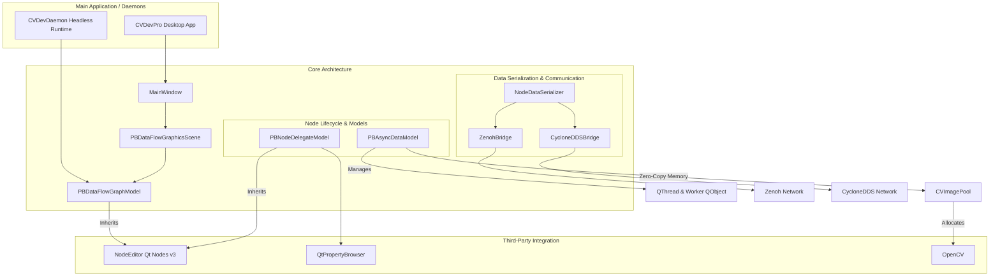
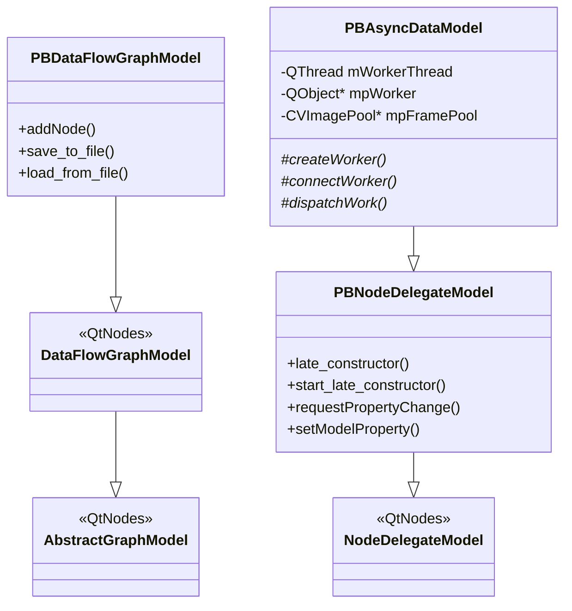

# CVDev Project Structure and Architecture Guide

This document describes the high-level design of CVDev, how the C++ classes are organized, and how they integrate with third-party libraries and Qt modules.

---

## 1. System Architecture

CVDev separates logic and rendering using a Model-View architecture. The diagram below illustrates the relationship between the application entry points, the core library, the node execution engine, and the external middleware:



---

## 2. Core Libraries & Third-Party Integration

### Qt Modules (`QtCore`, `QtWidgets`, `QtGui`, `QtOpenGL`)
* **`QtCore`**: Drives the core runtime. It handles QObjects, dynamic event loops, threading (`QThread`), sub-processes (`QProcess` in [PythonSessionWorker](file:///Users/pbunnun/Projects/CVDev/Plugins/BasicNodes/PythonSessionWorker.hpp)), and signals/slots communication.
* **`QtWidgets`**: Powers both the desktop editor workspace and custom embedded user controls inside node views (like line edits, buttons, and custom layout boxes).
* **`QtGui`**: Responsible for vector drawing, cursors, and pixel painting on the graphics scene using `QPainter`.
* **`QtOpenGLWidgets` / `QtOpenGL`**: Provides hardware-accelerated drawing pipelines to speed up visual graph rendering.

### NodeEditor (Qt Nodes v3)
The project utilizes **Qt Nodes v3**, which enforces a strict Model-View separation:
* **Graph Model**: The registry and structural connections are stored in a graph model class ([PBDataFlowGraphModel](file:///Users/pbunnun/Projects/CVDev/CVDevLibrary/PBDataFlowGraphModel.hpp)) subclassing `QtNodes::DataFlowGraphModel`. Nodes are tracked using integer `NodeId`s instead of raw pointers.
* **Model Delegates**: Individual node behaviors (properties, parameters, port types) are defined in subclasses of [PBNodeDelegateModel](file:///Users/pbunnun/Projects/CVDev/CVDevLibrary/PBNodeDelegateModel.hpp) (which extends `QtNodes::NodeDelegateModel`).
* **Graphics Scene & View**: Rendering is managed by the graphics scene subclass ([PBDataFlowGraphicsScene](file:///Users/pbunnun/Projects/CVDev/CVDevLibrary/PBDataFlowGraphicsScene.hpp)) and view subclass `PBFlowGraphicsView` inside a `QGraphicsView` viewport.

### QtPropertyBrowser
* Displays editable parameters for the currently selected node.
* Reads properties from [PBNodeDelegateModel::getProperty()](file:///Users/pbunnun/Projects/CVDev/CVDevLibrary/PBNodeDelegateModel.hpp#L63).
* Whenever a user modifies parameters, the view notifies `MainWindow` via [property_change_request_signal](file:///Users/pbunnun/Projects/CVDev/CVDevLibrary/PBNodeDelegateModel.hpp#L228) to wrap changes in a command object for Undo/Redo tracking.
* Programmatic changes (or Undo/Redo rewinds) push updates back to the browser panel using [property_changed_signal](file:///Users/pbunnun/Projects/CVDev/CVDevLibrary/PBNodeDelegateModel.hpp#L231).

### OpenCV
* Core image representation: the `CVImageData` class (inherits `QtNodes::NodeData`) wraps a reference-counted OpenCV frame matrix (`cv::Mat`).
* Nodes like `CVUSBCameraModel`, `CVColorSpaceModel`, and `CVMedianBlurModel` process these matrices using OpenCV algorithms inside dedicated background worker threads.

### Zenoh & CycloneDDS
* **`NodeDataSerializer`**: Packages active payloads (like `cv::Mat` frames in JPEG, PNG, or RAW) into a lightweight binary structure: `[Version:1][Type:1][DataSize:4][Data:N bytes]`.
* **`ZenohBridge`**: Handles low-latency remote communication. Publishes serialized node port data on Zenoh key paths (`cvdev/{session_id}/node/{node_id}/port/{port_idx}/data`) and consumes incoming streams asynchronously.
* **`CycloneDDSBridge`**: Handles DDS-based publish/subscribe configurations for cross-tab or cross-machine graph communication using named topics.
* **`TransportBridgeModelCommon`**: Centralizes common type-hinting, formatting, and encoding translation methods used by both Zenoh and DDS transport nodes.

---

## 3. Key C++ Classes and Model-View Separation

The class hierarchy follows standard Qt Model-View conventions, extended to support asynchronous processing:



### [MainWindow](file:///Users/pbunnun/Projects/CVDev/CVDevLibrary/MainWindow.hpp)
* Acts as the main controller for the graphical environment.
* Manages the `QUndoStack` for document history.
* Listens to model modifications and updates the [QtPropertyBrowser](file:///Users/pbunnun/Projects/CVDev/CVDevLibrary/MainWindow.cpp#L1122) dynamically when nodes are selected, changed, or resized.

### [PBDataFlowGraphModel](file:///Users/pbunnun/Projects/CVDev/CVDevLibrary/PBDataFlowGraphModel.hpp)
* Extends `QtNodes::DataFlowGraphModel` to orchestrate node connectivity and serialization.
* Manages the lifecycle of connections and validation states.
* Implements the `load_from_file` and `save_to_file` methods to serialize the workflow layout, coordinates, styles, and custom properties into a unified `.flow` file (JSON).

### [PBDataFlowGraphicsScene](file:///Users/pbunnun/Projects/CVDev/CVDevLibrary/PBDataFlowGraphicsScene.hpp)
* Extends `QtNodes::DataFlowGraphicsScene` to implement custom rendering overlays.
* Intercepts mouse events to handle custom header checkboxes (such as Enable/Disable, Lock Position, and Minimize Node).
* Integrates snap-to-grid alignment.

### [PBNodeDelegateModel](file:///Users/pbunnun/Projects/CVDev/CVDevLibrary/PBNodeDelegateModel.hpp)
* Extends `QtNodes::NodeDelegateModel` as the base class for all CVDev nodes.
* Defines parameters/properties vectors and handles setting properties via `setModelProperty`.
* Exposes `late_constructor()`, allowing heavy resources (like hardware camera connections, files, or thread pipelines) to initialize asynchronously only once the node has been successfully instantiated in the graph scene.

### [PBAsyncDataModel](file:///Users/pbunnun/Projects/CVDev/CVDevLibrary/PBAsyncDataModel.hpp)
* Inherits from `PBNodeDelegateModel`.
* Manages a background `QThread` and moves a child `QObject` worker class to it.
* Manages a `CVImagePool` to allocate and recycle frame memory. It handles backpressure by caching the latest pending frames and rejecting newer ones if the worker thread is busy.

---

## 4. Data Flow & Threading Patterns

### Local Direct Signals (Synchronous)
For simple, low-cost nodes (e.g. data conversions or basic arithmetic), data flows synchronously on the main thread via standard Qt signals. When an output port emits `dataUpdated()`, downstream nodes receive and process the data immediately.

### Asynchronous Worker Threading (Zero-Copy Pool)
Heavy vision pipelines (e.g. video capture, filtering, neural network inference) inherit from `PBAsyncDataModel` and operate asynchronously:

```
[Main GUI Thread]                   [Background Worker Thread]
       │                                       │
       │ 1. setInData(nodeData)                │
       ├──────────────────────────────────────▶│ 
       │ (dispatches work to worker queue)     │
       │                                       │ 2. Worker executes heavy task
       │                                       │    (OpenCV, ONNX, etc.)
       │                                       │ 
       │ 3. resultReady(processedData)         │ 
       │◀──────────────────────────────────────┤
       │ (emitted via Qt QueuedConnection)     │
       ▼                                       ▼
```

1. **Memory Allocation**: The model requests a frame container from its `CVImagePool`.
2. **Work Dispatch**: The model packages the input data and parameters, then dispatches the task to its worker thread queue using `QMetaObject::invokeMethod` with `Qt::QueuedConnection`.
3. **Execution**: The worker processes the image in the background, keeping the main GUI responsive.
4. **Return**: The worker emits a signal that transfers the output back to the main thread, updating downstream nodes.
5. **Recycling**: Once downstream nodes finish using the frame, the `CVImagePool` automatically reclaims the buffer for future frames, eliminating runtime memory allocations.

### Network Communication (Zenoh/CycloneDDS)
When nodes are configured for network transport:
* **Publisher Nodes** receive local data, serialize it using `NodeDataSerializer`, and publish it to the network via Zenoh or CycloneDDS.
* **Subscriber Nodes** run background network listener loops that pull payloads, deserialize them into standard `NodeData` structures, and schedule main-thread updates via `QMetaObject::invokeMethod`.
